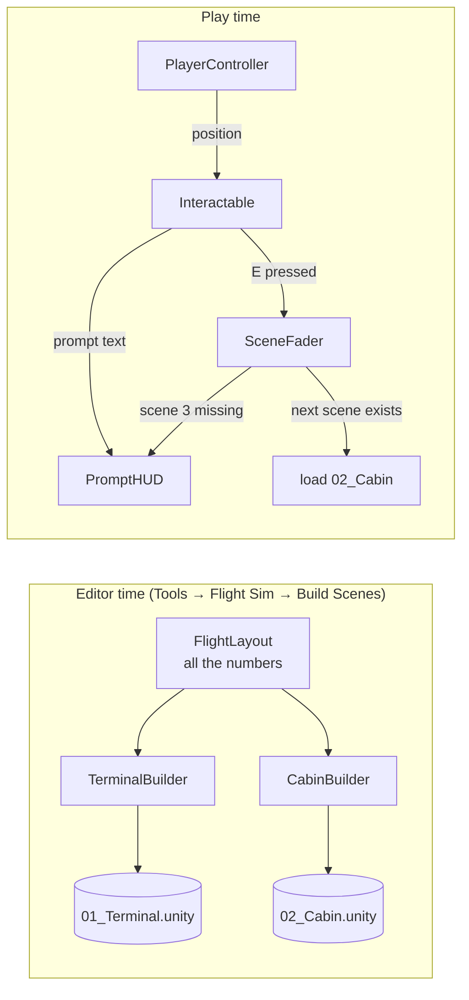

# How it works

A plain-English walkthrough of the Flight Sim project, written to explain it to someone else. It
covers what happens when you press Play, what every script does, the Unity ideas it relies on, and
the questions you're likely to be asked.

---

## 1. The big picture

There are two kinds of script in this project.

**Game scripts** (`Assets/Scripts/`) run while you play:

| Script | Its one job |
|---|---|
| `PlayerController` | Walk with WASD, look with the mouse |
| `Interactable` | "Is the player standing here? If they press E, go to the next scene" |
| `SceneFader` | Fade to black, load the next scene, fade back in |
| `PromptHUD` | Draw the text on screen |
| `BlinkingLight` | Flash the plane's beacon and the cockpit's caution light |
| `PassengerIdle` | Make passengers turn their heads now and then |
| `FlightLayout` | Not a behaviour: a list of every size and position |

**Editor scripts** (`Assets/Scripts/Editor/`) never run in the game. They **build the scenes**:

| Script | Its one job |
|---|---|
| `BuildAll` | The Tools → Flight Sim menu; runs the two builders |
| `TerminalBuilder` | Creates scene 1: the hall, the window, the plane, the runway |
| `CabinBuilder` | Creates scene 2: the cabin, the seats, the cockpit |
| `SharedParts` | Wings, engines, runway, jet bridge, used by both builders |
| `Figures` | Builds a sitting or standing person from simple shapes |
| `SceneKit` | The sun, sky, player, HUD and fader every scene needs |
| `Prim` | Places a cube/cylinder/sphere with a colour; makes materials |
| `SceneSnapshot` | Takes 8 pictures of the scenes |
| `Playtest` | Plays the whole game by itself and reports PASSED/FAILED |

How they connect:



---

## 2. What happens when you press Play

1. **Scene 1 loads.** Unity creates every object saved in `01_Terminal.unity`: the floor, the
   walls, the plane, the player, and an object called **Game Systems** that carries `PromptHUD`
   and `SceneFader`.
2. **`Awake` runs on everything.** `PromptHUD` and `SceneFader` each register themselves as
   `Instance`, so other scripts can find them without a reference.
3. **`Start` runs on everything.**
   - `PlayerController` reads which way it's facing and locks the mouse cursor. Logs `[PLAYER] Spawned at ...`.
   - `SceneFader` logs `[SCENE] Now in '01_Terminal'` and starts fading from black.
   - `Interactable` (the boarding zone) finds the player so it can watch where they are.
4. **Every frame, `Update` runs:**
   - `PlayerController` reads the mouse and turns the body (left/right) and camera (up/down).
     It reads WASD, builds a direction relative to where you're facing, and moves the
     CharacterController, which stops at walls.
   - `Interactable` checks whether the player is inside its box. When that changes, it tells
     `PromptHUD` to show or hide **Press E to board the plane**.
   - `BlinkingLight` turns the beacon on or off depending on the clock.
   - `PassengerIdle` turns each passenger's head a little.
5. **Every frame, `OnGUI` runs:** `PromptHUD` draws the crosshair, the title, and the prompt if
   one is set. `SceneFader` draws a black rectangle over the screen while it's fading.
6. **You press E in the zone.** `Interactable.Use()` calls `SceneFader.GoTo("02_Cabin")`.
   - The fader checks the scene is in Build Settings. It is.
   - It switches off player input, fades to black over 0.8 s, and calls `SceneManager.LoadScene`.
7. **Scene 2 loads**, and everything from step 2 happens again, this time in the cabin. Scene 1's
   objects are destroyed.
8. **In the cockpit you press E.** `SceneFader.GoTo("03_Takeoff")` finds scene 3 is **not** in
   Build Settings, so instead of loading it asks `PromptHUD` to show
   **Take-off is scene 3 - it hasn't been built yet.** Nothing crashes.

---

## 3. The game scripts, one by one

### `PlayerController`: walking and looking

- Uses a **CharacterController** component, Unity's ready-made "person" collider. You give it
  a movement vector with `Move()`, and it slides along walls instead of passing through them.
- **Two angles:** `yaw` (left/right) rotates the whole body; `pitch` (up/down) rotates only the
  camera, which is a child of the body. Because the body never tilts, "forward" stays flat, so
  looking up doesn't make you walk into the air.
- `Input.GetAxis("Mouse X")` gives how far the mouse moved this frame. `Input.GetAxisRaw("Horizontal")`
  gives −1, 0 or 1 from A/D.
- **Movement direction** = `transform.right × sideways + transform.forward × forwards`. If both keys
  are held that vector is longer than 1, so it's normalised; otherwise diagonal walking would be about 41% faster.
- **Gravity:** while `isGrounded`, a small downward speed keeps you pressed onto the floor.
  Otherwise the speed grows by −9.81 every second.
- Everything is multiplied by `Time.deltaTime` (the seconds since the last frame), so you walk the
  same speed at 30 fps and 144 fps.
- The CharacterController's **Min Move Distance is set to 0**. Unity's default ignores any move
  shorter than 1 mm, and at very high frame rates every frame's step is shorter than that, so
  the player would barely move. The automated playtest caught this.
- **Cursor:** Esc unlocks it; clicking locks it again.
- **Autopilot (`WalkTo`)** is used only by the automated playtest. It walks towards a point and
  turns to face it.

### `Interactable`: "press E here"

- Has a **box size** (`zoneSize`), a **prompt**, a **key** and a **scene to load**.
- Every frame: `transform.InverseTransformPoint(playerPosition)` converts the player's position
  into the zone's own coordinates, where the zone's centre is (0,0,0). Then the player is inside
  if each coordinate is within half the box size.
- It only tells the HUD when "inside" **changes**, so it isn't spamming the HUD every frame.
- `OnDrawGizmos` draws the box as a yellow wireframe in the Scene view, so you can see the zone.

### `SceneFader`: changing scenes

- `alpha` is how black the screen is (1 = black). Each scene starts at 1 and fades to 0.
- The fade is a **coroutine**: a function that pauses at `yield return null` and continues next
  frame. That lets a 0.8 s fade be written as a simple loop.
- `Application.CanStreamedLevelBeLoaded(name)` is true only for scenes listed in Build Settings,
  which is how it knows scene 3 doesn't exist yet.
- It draws the black overlay in `OnGUI` with `GUI.depth = -1000`, which puts it in front of the HUD.

### `PromptHUD`: text on screen

- Stores the current prompt (and who owns it), and the current message with an expiry time.
- `OnGUI` redraws everything every frame: the crosshair, the title for the first 4 seconds, the
  controls hint for 12 seconds, the prompt box, and the message box.
- Font size follows the window height, so it looks the same in the small editor view and full screen.
- **Only the zone that showed a prompt can hide it**, so two zones can't clear each other's prompt.

### `BlinkingLight`

`Mathf.Repeat(time, onSeconds + offSeconds)` wraps the clock into one cycle, and the light is on
during the first `onSeconds` of each cycle. There's no timer variable to manage. `offset` staggers
lights so they don't flash in unison.

### `PassengerIdle`

Head angle = `sin(t) × sin(0.37 t) × 35°`. Multiplying two sine waves of different speeds gives
mostly-still with occasional glances, which looks less robotic than a steady back-and-forth. Each
passenger gets a different `phase`.

### `FlightLayout`

Not a component: a `static class` of constants. The builders read it to place things, and the
playtest reads it for its walking route. **Change a number here and rebuild** to move anything.

### `Aircraft`: the flight model

The most important script in the flying half of the game, and the one most worth being able to
explain.

It keeps **four numbers**: speed, pitch, roll and heading. Every frame it nudges them towards what
the keys are asking for, then works out where the plane should be:

| Number | Moved by | Held back by |
|---|---|---|
| speed | thrust (`throttle x MaxThrustAccel`) | drag, which grows with **speed squared** |
| pitch | W and S | clamped to −20°…+25°, and returns to 0 when you let go |
| roll | A and D | clamped to ±55°, and returns to 0 when you let go |
| heading | the bank angle | nothing - a level plane flies straight |

Two lines do most of the work:

```csharp
speed += (thrust - drag) * dt;                              // drag = DragFactor * speed * speed
heading += 9.81f * Mathf.Tan(roll * Deg2Rad) / speed * Rad2Deg * dt;
```

The second is the **real formula for a balanced turn**: turn rate = g × tan(bank) ÷ speed. Steeper
bank turns tighter, and going faster turns wider, exactly as in a real aeroplane. That is why the
flying feels honest even though nothing else here is simulated.

There is **no lift equation and no angle of attack**, which is a deliberate choice, not a shortcut
that was never finished. It means the plane **cannot stall** — there is no lift to lose — and the
clamps mean it cannot flip. The only way to end a flight badly is to fly into the ground.

`scriptedFlight` hands the whole thing over to scene 4, where the flight model does not run at all.

### `FlightCamera`: the two views

V swaps between the pilot's seat and a camera outside. It is **not** a child of the aeroplane: it
places itself every frame in `LateUpdate`, which runs after everything has finished moving. A child
object cannot lag behind its own parent, and the chase camera has to lag to look smooth.

The chase view uses only the plane's **heading**, ignoring pitch and roll. If the camera rolled with
the plane, banking would spin the whole picture and you would lose the horizon.

### `FlightHUD`, `LiveInstruments`

`FlightHUD` draws speed, height, heading, the throttle bar and the gear state on the screen, and
owns the two ways a flight ends: the "Press L to begin landing" prompt, and the crash message that
restarts the scene. `LiveInstruments` drives the cockpit panel itself — the artificial horizon
rotates with roll and slides with pitch, and the gauges follow the throttle. It reads `Aircraft` and
writes transforms; it never works anything out twice.

If there is no aeroplane in the scene, `LiveInstruments` does nothing at all. That is what lets the
same cockpit be used in scene 2, where the plane is parked and there is nothing to show.

### `LandingSequence` and `EndCard`: scene 4

One clock and four stages: descent, flare, roll-out, arrived. At every moment the script works out
exactly where the plane should be and calls `Aircraft.PlaceForScript` to put it there. Because it
moves the *same* `Aircraft` component, the instruments, the engine sound and both cameras carry on
working with no special cases anywhere.

`EndCard` shows the arrival card and restarts the whole game on R. `FlightClock` is a plain `static`
class holding the journey time — static rather than a component, because every scene destroys its
own objects when the next one loads, while a static value belongs to the program and simply carries
on.

### The captain, and the photograph for a face

`Figures.Pilot` builds him from the same shapes as everyone else - capsule torso, box limbs, sphere
head - in a uniform with a headset, arms reaching forward to the controls.

The face is the one textured thing in the entire project. Everything else is a flat colour. A
photograph cannot be wrapped around a sphere without smearing badly at the edges, so instead
`Prim.Picture` puts it on a **flat card** (a Quad) sitting just clear of the front of the skull.
Two details matter:

- The card is **smaller than the skull on purpose**. Sized to match, the photo covers the head
  completely and he reads as a cutout stuck on a snowman; leaving a margin lets the skull and hair
  frame the face the way a real head does.
- **His head is turned towards the other seat.** You come into the cockpit from behind, so a pilot
  looking straight ahead would show you nothing but the back of his head. The turn is also the only
  angle a flat face really works from.

If the picture file is missing he still builds - he just gets a plain face and the Console says so.
The scenes are generated, so a missing file has to be a warning, not a broken build.

### `AircraftAudio`, `Ambience`, `Footsteps`

`AircraftAudio` invents nothing: it watches `Aircraft` and turns those numbers into volume and
pitch. Two engine loops play at once, quiet idle and loud roar, and the throttle **crossfades**
between them — pitching a single sound up instead would make a jet sound like a hairdryer.

`Footsteps` counts **distance walked**, not time. On a timer, walking into a wall would still make
footsteps, and they would fall out of step with your speed.

---

## 4. The editor scripts, one by one

### `BuildAll`
Adds the **Tools → Flight Sim** menu using `[MenuItem]`. **Build Scenes** sets a few project
settings (linear colour space, 8 per-pixel lights, shadows), runs both builders, and writes the
scene list into Build Settings.

### `TerminalBuilder` and `CabinBuilder`
Each one creates an empty scene, calls a series of small functions (`Shell`, `WindowWall`,
`Seating`, `Gate`, …), adds the sun, the player, the zone and the HUD, and saves the scene. Each
function is a list of "put a box of this size and colour here" calls, reading positions from
`FlightLayout`.

Two ideas worth knowing:
- **Solid or not.** Walls, floors, glass and seat blocks keep their colliders. Decoration
  (screens, lights, seat cushions) has them removed, which saves the physics engine checking
  thousands of shapes you can never touch.
- **Invisible blockers.** In the cabin, one invisible box covers each side's seats. That one box is
  what keeps you in the aisle, rather than 120 individual seat colliders.

### `SharedParts`
The wings, engines, runway and jet bridge, used by both scenes so they match. A wing is a flat box
rotated by the sweep angle. Its centre is found by rotating "half a wing length sideways" by the
same angle.

### `Figures`
A person is a capsule body, box legs and arms, and a head pivot holding a sphere, hair and a nose.
Colours are picked from lists by a number, so each person looks different but a rebuild gives the
same result.

### `SceneKit`
Creates the sun (a directional light), the procedural sky, the ambient light colours, the fog,
the player (a CharacterController body with a camera child at eye height), and the Game Systems
object.

### `Prim`
Helpers that wrap `GameObject.CreatePrimitive`. It also hides a Unity quirk: the cylinder mesh is
2 units tall and 1 wide, so a cylinder of radius r and length L needs scale (2r, L/2, 2r).
Materials are **updated in place** rather than recreated, because both scenes share them.

### `FlightBuilder` and `LandingBuilder`
Build scenes 3 and 4. They are almost the same scene: the same world, the same aeroplane, the same
cockpit, the same camera. The differences are where the plane starts and who moves it.

### `WorldParts`
The airfield both flying scenes share - runway, taxiway, terminal, control tower, fields, roads,
tower blocks, the coastline, the sea, the horizon hills and the clouds. Roughly a thousand objects,
**none of them with a collider**, because you can never touch any of them and a thousand colliders
would be work the physics engine does for nothing.

### `CockpitParts`
The cockpit interior, in one file, used by scenes 2, 3 and 4. It is why the windscreen you look
through in the air is the one you walked up to on the ground.

### `AudioBank`
Generates all 13 sounds from maths and writes them as real `.wav` files. See the questions below
for the one problem that makes this harder than it sounds.

### `SceneSnapshot` and `Playtest`
`SceneSnapshot` places a temporary camera at 14 fixed viewpoints and saves each render as a PNG.
`Playtest` enters play mode, walks the route with the player's autopilot, then **flies the take-off
with the aeroplane's autopilot**, climbs away, checks both cameras, starts the approach and watches
the landing to the arrival card. It records any error message and fails if the player is stuck, a
zone isn't reached, a scene never loads, the plane crashes, or the landing never finishes.

---

## 5. Unity ideas used

| Idea | Where |
|---|---|
| **GameObject + components**: an object is a container; behaviour comes from components attached to it | Everywhere |
| **Transform**: position, rotation, scale, and parent/child relationships | The camera is a child of the player; screens are children of the tilted panel |
| **MonoBehaviour lifecycle**: `Awake` → `Start` → `Update` every frame → `OnGUI` | All game scripts |
| **CharacterController**: movement with collision, without physics simulation | `PlayerController` |
| **Colliders**: invisible shapes that block movement | Walls, floor, glass, seat blocks |
| **Local vs world space**: `InverseTransformPoint` | `Interactable` |
| **Coroutines**: functions that run across several frames | `SceneFader` |
| **Scene management and Build Settings** | `SceneFader`, `BuildAll` |
| **Materials and shaders**: Standard shader, emission for glowing things, Fade mode for glass | `Prim` |
| **Lights**: directional (sun), point (ceiling lights) | `SceneKit`, both builders |
| **Editor scripting**: `[MenuItem]`, `EditorSceneManager` | `BuildAll`, both builders |

---

## 6. Likely questions, with answers

**Is this a real flight simulator?**
No, and deliberately not. It keeps four numbers — speed, pitch, roll and heading — and moves the
plane from them. There is no lift equation, no angle of attack and no Rigidbody. A real flight model
can stall and spin, which is miserable to demonstrate and much harder to explain. What it *does* use
is the real formula for a banked turn, so the flying still behaves sensibly.

**Why can't it stall?**
Because lift is never calculated. A stall is what happens when a wing stops producing enough lift;
if you never model lift, there is no lift to lose. On top of that, pitch is clamped to −20°…+25° and
roll to ±55°, so the plane cannot be put into an attitude it could not recover from.

**Where does the turn rate come from?**
`turn rate = g × tan(bank) ÷ speed`. That is the standard result for a balanced turn: the horizontal
part of the lift vector provides the centripetal force. It is why banking harder turns tighter, and
why flying faster makes the same bank angle turn a wider circle.

**What stops it accelerating for ever?**
Drag grows with the **square** of speed, so it catches up with thrust. Full throttle balances drag at
about 260 m/s, and nothing has to clamp the speed by hand.

**How is the take-off prevented at walking pace?**
Below rotation speed the nose simply will not come up, however hard you pull. That one rule replaces
a whole stall model.

**How are the sounds made, if nothing was downloaded?**
`AudioBank.cs` builds every clip out of sine waves and filtered noise and writes real `.wav` files
into `Assets/Audio/`. A jet is a low tone plus its harmonics plus broadband noise; wind is noise
with the low frequencies filtered out; a chime is two sine waves with a long decay.

**What is the hard part about generating a looping sound?**
Making the end join the start. If the last sample does not lead naturally into the first, you hear a
**click once per loop**, and it sounds broken. Two things fix it: every tone is snapped to a
frequency that fits a whole number of cycles into the clip, and each noise layer's tail is
crossfaded into a pre-generated run-up of the same noise. The build then measures the join and warns
if it is still too big a jump.

**Why does the artificial horizon need a frame around it?**
Because it rotates. The sky-and-ground card has to be bigger than the hole you see it through, or a
corner would swing into view when you bank. The bezel is four black bars sitting slightly in front
of the screen, and they hide the overflow.

**Scene 4 doesn't let me do anything. Isn't that cheating?**
It is a choice, and it is the honest answer to give. The landing is a fixed timeline, so it looks
correct every single time it is shown. You can still look around and swap cameras. Scene 3 is where
you actually fly.

**Why a CharacterController instead of a Rigidbody?**
A Rigidbody is a physics object. It can be pushed, can tip over, and needs friction, drag and
rotation locks to behave like a person. A CharacterController is made for exactly this: you tell it
where to move, it stops at walls and climbs small steps, and nothing can knock it over.

**How does the game know you're at the gate?**
The boarding zone is an invisible box. Every frame it converts the player's position into the box's
own coordinates and checks whether it's within half the box's size on every axis. If so it shows
the prompt, and pressing E loads the next scene.

**Why not use a trigger collider for that?**
Triggers work, but they depend on several things being set up correctly (a Rigidbody or
CharacterController, the right layers, the right callback) and fail silently when one is wrong. A
box check is one short function with no hidden requirements.

**How does the scene change work?**
`SceneFader` fades the screen to black with a coroutine, then calls `SceneManager.LoadScene`. The
new scene has its own fader, which starts black and fades in.

**What happens if you press take-off, since scene 3 doesn't exist?**
The fader asks `Application.CanStreamedLevelBeLoaded("03_Takeoff")`. It returns false because scene
3 isn't in Build Settings, so a message is shown instead of loading. Once scene 3 is built and added,
the same button works without changing any code.

**Why were the scenes made by code instead of dragging objects in?**
It's repeatable (a rebuild always gives the same scene), every measurement is in one file
(`FlightLayout`), mistakes are undone by rebuilding, and the whole scene can be explained by reading
code. The trade-off is that editor changes don't survive a rebuild.

**Why do you multiply by `Time.deltaTime`?**
Update runs once per frame, and frame rates vary. Multiplying a speed (metres per second) by the
seconds since the last frame gives the distance for *this* frame, so the player walks at the same
real speed on any computer.

**Why is only the camera tilted up and down, not the whole player?**
If the body tilted, "forward" would point into the floor or the sky, and looking down while pressing W
would push you into the ground. Keeping the body level means forward is always along the floor.

**Why normalise the movement vector?**
Holding W and D gives a vector of (1, 0, 1), which is about 1.41 long, so diagonal walking would be
41% faster. Normalising makes it length 1.

**How is the glass see-through?**
Its material uses the Standard shader's Fade mode with a low alpha (about 15% opaque). Glass also
doesn't cast shadows, so sunlight reaches the cabin floor through the windows.

**How do you stop the player walking into the seats in the cabin?**
One invisible box collider covers all the seats on each side. The gap between the two boxes is the
aisle, 0.62 m wide, and the player is 0.5 m wide.

**How do you know it works?**
The Playtest tool plays the game by itself: it walks to the gate, boards, walks the aisle, enters
the cockpit and presses take-off. It fails if there's any error, if the player gets stuck, or if a
scene doesn't load. The Console also logs each step with a tag (`[PLAYER]`, `[INTERACT]`, `[SCENE]`).

---

## 7. Changing things

| To… | Change… then **Tools → Flight Sim → Build Scenes** |
|---|---|
| Move the plane outside the terminal | `FlightLayout.Terminal.PlaneCentre` |
| Change where you start | `PlayerSpawn` / `PlayerSpawnYaw` in `Terminal` or `Cabin` |
| Add seat rows | `FlightLayout.Cabin.Rows` (also move `RearWallX` back 0.8 m per row) |
| Make the gate zone bigger | `FlightLayout.Terminal.BoardingZoneSize` |
| Change the prompt text | the `SceneKit.Zone(...)` call in `TerminalBuilder.Build` or `CabinBuilder.Build` |
| Walk faster | `walkSpeed` on the Player's `PlayerController` (also fine to change in the Inspector while testing) |
